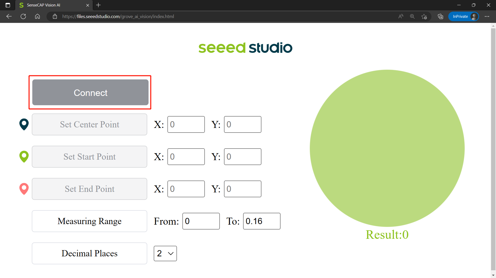
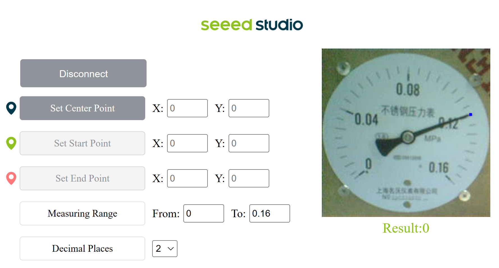
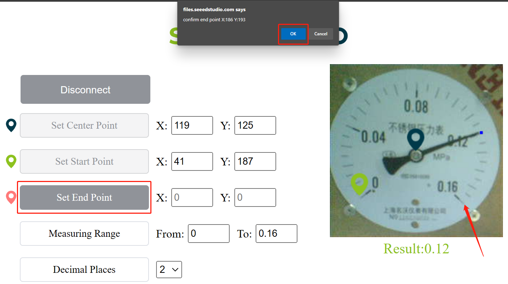

# Train and deploy a meter model on Grove - Vision AI

## Introduction

This tutorial shows how to train and deploy a meter reading detection model on Grove - Vision AI

## Prerequisites

### Hardware
- PC with Linux, WSL2 is also supported.
- Grove - Vision AI
- USB cable

### Software
- [EdgeLab](https://edgelab.readthedocs.io/zh_CN/latest/)
- [edgelab-example-vision-ai](https://github.com/Seeed-Studio/edgelab-example-vision-ai)

```{note}
Plesae make sure that you have installed the latest version of EdgeLab
```
## Train the model

### Prepare the dataset

Use the provided dataset to train the model.

```bash
cd EdgeLab
mkdir -p datasets
cd datasets
wget https://files.seeedstudio.com/wiki/Edgelab/meter.zip
unzip meter.zip
```
### Train the model

#### Download the pre-trained model.
```bash
cd EdgeLab
mkdir -p work_dirs/pretrain/ && cd work_dirs/pretrain
wget  https://github.com/Seeed-Studio/EdgeLab/releases/download/model_zoo/pfld_mv2n_112.pth 
```

#### Start training.
```bash
cd EdgeLab
conda activate edgelab
python tools/train.py mmpose configs/pfld/pfld_mv2n_112_custom.py --gpus=1 --cfg-options total_epochs=50 load_from=./work_dirs/pretrain/pfld_mv2n_112.pth 
```

## Convert the model

**Step 1:** Convert models to TensorFlow Lite.

```bash
cd EdgeLab
conda activate edgelab
python tools/torch2tflite.py mmpose  configs/pfld/pfld_mv2n_112_custom.py --weights work_dirs/pfld_mv2n_112_custom/exp1/latest.pth --tflite_type int8 
```

Now we will convert the generated TFLite file to a UF2 file so that we can directly flash the UF2 file into Grove - Vision AI Module and SenseCAP A1101

**Step 2:** Execute the following

```bash
cd edgelab-example-vision-ai
python tools/uf2conv/ -f GROVEAI -t 1 -c <path to model.tflite> -o model.uf2
```

## Prepare the firmware

### Build the firmware
```bash
cd edgelab-example-vision-ai
make HW=grove_vision_ai APP=meter
```
### Convert the firmware to UF2 file

```bash
cd edgelab-example-vision-ai
python3 tools/ufconv/uf2conv.py -t 0 -c tools/image_gen_cstm/output/output.img -o firmware.uf2
```

### Flash the model and model

This explains how you can flash the previously generated firmware (firmware.uf2) and the model file (model.uf2) to Grove - Vision AI Module and SenseCAP A1101.

**Step 1.** Connect Grove - Vision AI Module/ SenseCAP A1101 to PC by using USB Type-C cable 


**Step 2.** Double click the boot button to enter **boot mode**


**Step 3:** After this you will see a new storage drive shown on your file explorer as **GROVEAI** for **Grove - Vision AI Module** and as **VISIONAI** for **SenseCAP A1101**


**Step 4:** Drag and drop the previous **firmware.uf2** at first, and then the **model.uf2** file to **GROVEAI** or **VISIONAI** 

```note
You need to enter DFU mode twice separately, once to flash the firmware and once to flash the model.Once the copying is finished **GROVEAI** drive will disapper. This is how we can check whether the copying is successful or not.
```

## Run the model 

**Step 1:** After loading the firmware and connecting to PC, visit [this URL](https://files.seeedstudio.com/grove_ai_vision/index.html)
        
**Step 2:** Click **Connect** button. Then you will see a pop up on the browser. Select **Grove AI - Paired** and click **Connect**

        

        
Upon successful connection, you will see a live preview from the camera. Here the camera is pointed at an analog meter.


        
Now we need to set 3 points which is the center point, start point and the end point. 
        
**Step 3:** Click on **Set Center Point** and click on the center of the meter. you will see a pop up confirm the location and press **OK**
    
 

You will see the center point is already recorded


        
**Step 4:** Click on **Set Start Point** and click on the first indicator point. you will see a pop up confirm the location and press **OK**
        

        
You will see the first indicator point is already recorded
        

        
**Step 5:** Click on **Set End Point** and click on the last indicator point. you will see a pop up confirm the location and press **OK**


        
You will see the last indicator point is already recorded
        

        
**Step 6:** Set the measuring range according to the first digit and last digit of the meter. For example, he we set as **From:0 To 0.16**
        

        
**Step 7:** Set the number of decimal places that you want the result to display. Here we set as 2
        

        
Finally you can see the live meter reading results as follows

